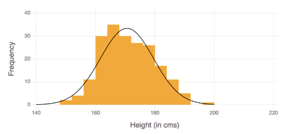
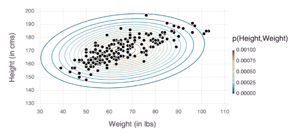
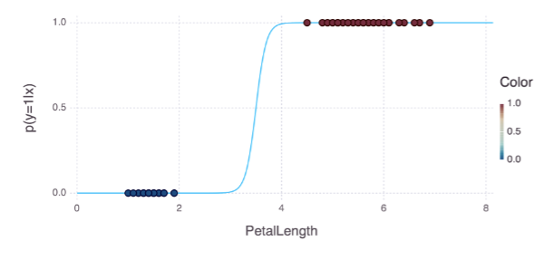
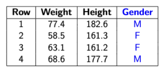
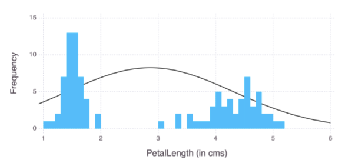
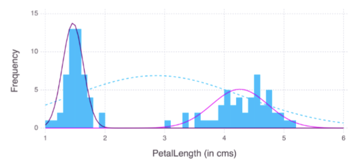

## Parameter Estimation (using MLE)
- Fitting Univariate distribution p(x)
    - Height of 200 subjects
    $$p(x|\mu, \sigma^2)=\frac{1}{\sqrt{2\pi\sigma^2}}e^{-(x_i-\mu)^2/2\sigma^2}$$
    

- Fitting Multivariate distribution p(x) or $p([x_1, x_2, ..., x_n])$
    - Height and weight of 200 subjects
    $$p(x|\mu, \Sigma)=\mathcal{N}(x|\mu,\Sigma)=\frac{1}{\sqrt{det(2\pi\Sigma)}}e^{-\frac{1}{2}(x-\mu)^T\Sigma^-1(x-\mu)}$$
    

- Fitting Logistic regression distribution p(y|x)
    - Predicting speices from petal length
    $$p(y=1|x)=\frac{1}{1+e^{\beta_0+\beta_1x}}$$
    

## Latent variable
Latent variables are random variables whose values are not specified in the observed data

For example, gender is a latent variable that is not measured

- To explain observed data in terms of unobserved concepts
    - A doctor may group patients into those with a certain syndrome and those without
        - Grouping makes it easier to understand relationships between observed symptoms
    - A biologist may group animals into distince species
        - Grouping makes it easier to explain behavioral or physiological patterns
- Often these distinctions can't be observed or measured

$$p(v|\theta)=\sum_h p(v, h|\theta)$$
- v: observed/visible
- h: hidden/latent

We want to model p(v, h)

## Mixture models
- Parameter estimatio based on observed variables is not always idead for modeling data

- Data is modeled as a mixture of several components, each has simple parametric form (such as Gaussian)

$$f(x)=\sum_{i=1}^k \lambda_i f_i(x)$$
- $\lambda_i$ are mixing weights, $\lambda_i > 0, \sum_i \lambda_i=1$

$$z_i \sim Multinomial(\lambda_1, \lambda_2, ..., \lambda_k)$$
$$x_i|z_i \sim f_{z_i}$$

## Expectation Maximixation Approach
- If we knew which subjects were male and female, computing $\mu_M$ and $\mu_F$ is straightforward, which simplifies to univariate Gaussian parameter estimation
-  With Bayes rule:
$$p(z_i|x_i)=\frac{p(x_i|z_i)p(z_i)}{p(x_i)}=\frac{\prod_c(\pi_c\mathcal{N}(x_i;\mu_c, \sigma^2))^{1(z_i=c)}}{\pi_M\mathcal{N}(x_i;\mu_M, \sigma^2)+\pi_F\mathcal{N}(x_i;\mu_F, \sigma^2)}$$

$$p(M|x_i)=\frac{\pi_M\mathcal{N}(x_i;\mu_M, \sigma^2)}{\pi_M\mathcal{N}(x_i;\mu_M, \sigma^2)+\pi_F\mathcal{N}(x_i;\mu_F, \sigma^2)}$$

$$\mu_M=\frac{\sum_{i=1}^n p(M|x_i)x_i}{\sum_{i=1}^n p(M|x_i)}, \, \mu_F=\frac{\sum_{i=1}^n p(F|x_i)x_i}{\sum_{i=1}^n p(F|x_i)}$$

To compute posterior prob $p(M|x_i)$, we need $\mu_M$ and $\mu_F$, to compute $\mu_M$ and $\mu_F$, we need $p(M|x_i)$ and $p(F|x_i)$ 

=> Fix one and solve for the other, iteratively
### EM Algorithm
- **E Step**: fix parameters $\mu_M$ and $\mu_F$ and compute posterior $p(M|x_i)$ and $p(F|x_i)$  
- **M Step**: fix posterior $p(M|x_i)$ and $p(F|x_i)$ and optimize for $\mu_M$ and $\mu_F$
- Repeat 2 steps until values converge
