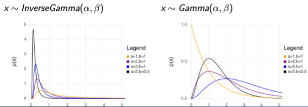
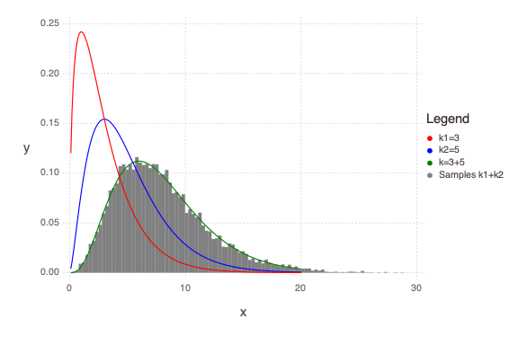

## Gamma Distribution
- In case of electronic components
    - few have very short life length
    - many have something close to an avg life length
    - very few have extraordinarily long life length

Used to model the times that elapses before $\alpha$ occurrences of randomly-occurring event. Such events are said to occur according to Poisson dist

$$f(x)=\frac{1}{\Gamma(\alpha)\beta^\alpha}x^{\alpha-1}e^{-x/\beta}, x\ge 0$$
$$or \, f(x)=\frac{x^{\alpha-1}e^{-x/\beta}}{\Gamma(\alpha)\beta^\alpha}, x\ge 0$$
where $\Gamma(\alpha)=\int_0^\infty x^{\alpha-1}e^{-x}dx$
- Denominator is normalizing factor
- $\beta$: avg time between occurrences, the **scale** parameter
- Sometimes, we use rate $\lambda=1/\beta$: avg number of occurrences per unit time
- $\alpha$: the $\alpha^{th}$ event, the **shape** parameter

=> Exponential dist is a special case of Gamma dist (alpha = 1), which models the waiting time between occurrences in a Poisson process

$E(x)=\int_0^\infty x\frac{1}{\Gamma(\alpha)\beta^\alpha}x^{\alpha-1}e^{-x/\beta}dx=\alpha\beta$

$\sigma^2=\alpha(\alpha+1)\beta^2-\alpha^2\beta^2=\alpha\beta^2$

## Inverse Gamma Distribution
- If 1/x follows Gamma dist with para alpha and beta, x has inverse gamma dist
- Generally used in Bayesian analysis

$$f(x)=\frac{1}{\Gamma(\alpha)\beta^\alpha}x^{-(\alpha-1)}e^{-1/x\beta}, x\ge 0$$



## Chi Square Distribution
Special case of Gamma Distribution
- $\alpha=k/2, \, \beta=2$
- $X_k^2\sim \Gamma(\frac{k}{2}, 2)$

$$f(x)=\frac{x^{\frac{k}{2}-1}e^{-\frac{x}{2}}}{\Gamma(\frac{k}{2})2^{\frac{k}{2}}}, x\ge 0$$

$\mu = k$\
$\sigma^2=2k$



### **Additive property**:
If $x1\sim X_{k_1}^2$ and $x2\sim X_{k_2}^2$ are independent $X^2$ variables, then $x_1+x_2\sim X_{k_1+k_2}^2$

## Inverse Chi Square Distribution
Special case of Inverse Gamma Distribution, it models the distribution of the sum of the squares of r random variables, each with the standard normal distribution
- $\alpha=\frac{k}{2}, \, \beta=2$

$$f(x)=\frac{x^{-(\frac{k}{2}-1)}e^{-1/2x}}{\Gamma(\frac{k}{2})2^\frac{k}{2}}, x\ge 0$$

### Julia Codes:
Gamma:
```julia
# params \alpha and \beta
d = Gamma(1, 2)
```

InverseGamma:
```julia
# params \alpha and \beta^-1
d = InverseGamma(1, 0.5)
```

Chi Square:
```julia
# param k
d = Chisq(1)
```

## Gaussian/Normal Distribution
$$f(x)=\frac{1}{\sigma\sqrt{2\pi}}e^{-(x-\mu)^2/2\sigma^2}, -\infty<x<\infty$$

$E(x)=\mu$ \
$E[(x-\mu)^2]=\sigma^2$

## Beta Distribution
Other distributions are positive over infinite interval \
Beta is constrained to (0, 1)

$$f(x)=\frac{\Gamma(\alpha+\beta)}{\Gamma(\alpha)\Gamma(\beta)}x^{\alpha-1}(1-x)^{\beta-1}, 0<x<1$$
$\alpha$ and $\beta$ are positive constants \
Left fraction is normalizing factor

$E(x)=\frac{\alpha}{\alpha+\beta}$ \
$\sigma^2=\frac{\alpha\beta}{(\alpha+\beta)^2(\alpha+\beta+1)}$

## Weibull Distribution
Gamma dist used to model life lengths of components
- failure rate func for Gamma dist has an upper bound
- limits real systems applicability

Weibull dist provides a better dist for life length data

$$f(x)=\frac{\gamma}{\theta}x^{\gamma-1}e^\frac{-x^{\gamma}}{\theta},x>0$$
$\theta$ (scale parameter) and $\gamma$ (shape parameter) are positive parameters

- $\gamma=1$ => exponential dist
- $\gamma>1$, this func looks like gamma functions, with different math props

$$cdf(x)=-e^\frac{-x^{\gamma}}{\theta}|_0^x=1-e^\frac{-x^{\gamma}}{\theta}, x\ge 0$$

$E(x)=\int_0^\infty x\frac{\gamma}{\theta}x^{\gamma-1}e^\frac{-x^{\gamma}}{\theta}dx$\
Let $y=x^\gamma$ or $x=y^{1/\gamma}$

$E(x)=E(y^{1/\gamma})=\int_0^\infty y^{1/\gamma}\frac{1}{\theta}e^{-y/\theta}dy=\theta^{1/\gamma}\Gamma(1+\frac{1}{\gamma})$

## Bivariate and Multivariate Prob Dist

### Discrete
$p(x, y)=P(X=x, Y=y)$
- $p(x, y)\ge 0, x,y\in (R)$
- $\sum_x\sum_yp(x, y)=1$

$cdf(x, y)=P(X\le x,Y\le y)=\sum_{x=-\infty}^a\sum_{y=-\infty}^b p(x,y)$

### Continuous
$P(a\le X\le b, c\le Y\le d)=\int_c^d\int_a^b f(x,y)dxdy$

$cdf(a,b)=P(X\le a, Y\le b)=\int_{-\infty}^b\int_{-\infty}^a f(x, y)dxdy$

#### Marginal 
- $f(x)=\int_{-\infty}^\infty f(x,y)dy$ 
- $f(y)=\int_{-\infty}^\infty f(x,y)dx$

#### Conditional Prob Dist 
$$f(x|y)=
    \begin{cases}
        \frac{f(x,y)}{f(y)}, & f(y)>0\\
        0, & elsewhere
    \end{cases}
$$
#### Independent: 
Continuous x and y are said to be independent if $f(x,y)=f(x)f(y)$

$E[g(x,y)]=\sum_x\sum_y g(x,y)p(x,y)$

$E[g(x,y)]=\int_{-\infty}^{\infty}\int_{-\infty}^{\infty} g(x,y)p(x,y)dxdy$

If independent:
$E(xy)=E(x)E(y)$

$E[g(x)h(x)]=E[g(x)]E[h(y)]$

#### Covariance
$cov(x,y)=E[(x-\mu_x)(y-\mu_y)]=E(xy)-\mu_x\mu_y$

Since cov depends on the units of measurement, we can use corr\
$\rho=\frac{E[(x-\mu_x)(y-\mu_y)]}{\sqrt{\sigma_x^2\sigma_y^2}}=\frac{cov(x,y)}{\sqrt{\sigma_x^2\sigma_y^2}}=\frac{cov(x,y)}{\sigma_x\sigma_y}$

- Unitless [-1, 1]
- If x and y are independent: $cov(x,y)=0$