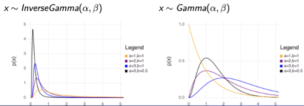

## Gamma Distribution
- In case of electronic components
    - few have very short life length
    - many have something close to an avg life length
    - very few have extraordinarily long life length

$$f(x)=\frac{1}{\Gamma(\alpha)\beta^\alpha}x^{\alpha-1}e^{-x/\beta}, x\ge 0$$
where $\Gamma(\alpha)=\int_0^\infty x^{\alpha-1}e^{-x}dx$
- Denominator is normalizing factor

=> Exponential dist is a special case of Gamma dist (alpha = 1)

$E(x)=\int_0^\infty x\frac{1}{\Gamma(\alpha)\beta^\alpha}x^{\alpha-1}e^{-x/\beta}dx=\alpha\beta$

$\sigma^2=\alpha(\alpha+1)\beta^2-\alpha^2\beta^2=\alpha\beta^2$

## Inverse Gamma Distribution
- If 1/x follows Gamma dist with para alpha and beta, x has inverse gamma dist
- Generally used in Bayesian analysis

$$f(x)=\frac{1}{\Gamma(\alpha)\beta^\alpha}x^{-(\alpha-1)}e^{-1/x\beta}, x\ge 0$$



## Chi Square Distribution
Special case of Gamma Distribution
- $\alpha=k/2, \, \beta=2$
- $X_k^2\sim \Gamma(\frac{k}{2}, 2)$

$$f(x)=\frac{1}{\Gamma(\frac{k}{2})2^{\frac{k}{2}}}x^{\frac{k}{2}-1}e^{-\frac{x}{2}}, x\ge 0$$

### **Additive property**:
If $x1\sim X_{k_1}^2$ and $x2\sim X_{k_2}^2$ are independent $X^2$ variables, then $x_1+x_2\sim X_{k_1+k_2}^2$

## Inverse Chi Square Distribution
Special case of Inverse Gamma Distribution
- $\alpha=\frac{k}{2}, \, \beta=2$

$$f(x)=\frac{1}{\Gamma(\frac{k}{2})2^\frac{k}{2}}x^{-(\frac{k}{2}-1)}e^{-1/2x}, x\ge 0$$

### Julia Codes:
Gamma:
```julia
# params \alpha and \beta
d = Gamma(1, 2)
```

InverseGamma:
```julia
# params \alpha and \beta^-1
d = InverseGamma(1, 0.5)
```

Chi Square:
```julia
# param k
d = Chisq(1)
```
