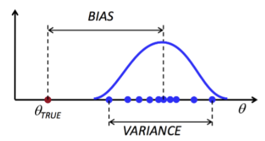

# Parameter Estimation
## Maximum Likelihood Estimation (MLE)
- Parameters are assumed to be fixed but unknown
- Search solution best explaining X
$$\hat{\theta}_{MLE}=argmax_\theta p(X|\theta)$$

## Bayesian Estimation
- Parameters are assumed to be random variables with priori distribution $p(\theta)$
- Seek to estimate posterior density $p(\theta|X)$
$$p(\theta|X)\propto p(X|\theta)p(\theta)$$
$$\hat{\theta}_{MAP}=argmax_\theta p(\theta|X)$$

# Bias vs. Variance

# Likelihood function $L(\theta|D)$
$$p(x_1,...,x_n|\theta)=p(x_1|\theta)...p(x_n|\theta)=\prod_{i=1}^n f(x_i|\theta)=L(\theta|x)$$

$$\hat{\theta}_{MLE}=argmax_\theta p(D|\theta)=argmax_{x_\theta} L(\theta)$$
